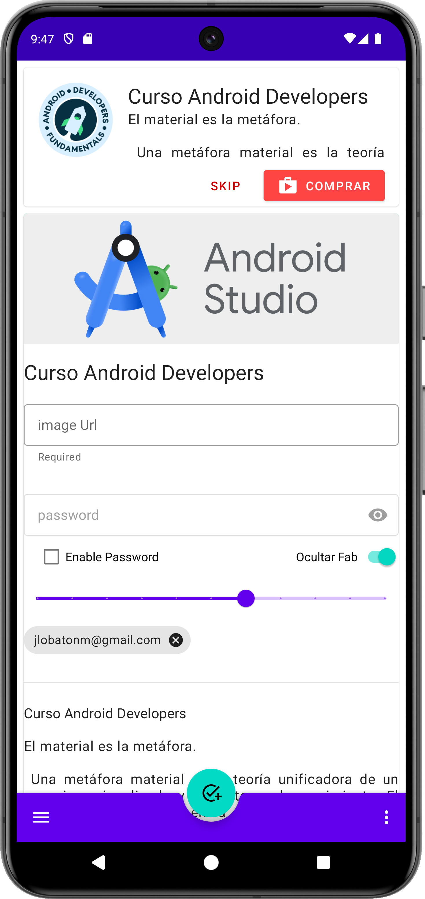

# MDC App

Este proyecto es una aplicación Android desarrollada en Kotlin, que permite a los usuarios explorar y aplicar diversos componentes de Material Design en sus proyectos. Los usuarios pueden interactuar con elementos como botones flotantes, barras de navegación, tarjetas, y más, para entender cómo implementar y personalizar estos componentes. La aplicación sigue el patrón de diseño MVVM para su arquitectura y utiliza Glide para la carga de imágenes.

## Características

- Exploración de componentes de Material Design.
- Interacción con elementos como botones flotantes, snackbar, chips, y más.
- Personalización de componentes para adaptarlos a las necesidades del proyecto.
- Carga y manipulación de imágenes con Glide.
- Arquitectura MVVM.

## Capturas de Pantalla

</img>

## Manual de Instrucciones para "MDC App"

### 1. Inicio de la aplicación
Al abrir "MDC App", serás recibido por la pantalla principal que muestra una variedad de componentes de Material Design disponibles para explorar.

### 2. Navegación principal
La interfaz es intuitiva, con una navegación fácil entre los diferentes componentes disponibles, como botones flotantes, barras de navegación, y tarjetas.

### 3. Interacción con componentes
Selecciona cualquier componente de la lista para ver una demostración de su funcionamiento y opciones de personalización.

### 4. Personalización de componentes
Explora las diferentes maneras de personalizar cada componente, como cambiar colores, formas, y comportamientos.

### 5. Carga de imágenes
Aprende a utilizar Glide para cargar y manipular imágenes dentro de tu aplicación, mejorando la experiencia visual.

### 6. Soporte y contacto
Si tienes preguntas o necesitas soporte, por favor contacta a <a href="mailto:jlobatonm@gmail.com">jlobatonm@gmail.com</a>.

## Tecnologías Utilizadas

- **Kotlin**: Lenguaje de programación.
- **Glide**: Biblioteca para la carga de imágenes.
- **MVVM**: Patrón de arquitectura.
- **Android Studio**: Entorno de desarrollo integrado.

## Instalación

Para instalar y ejecutar este proyecto en tu entorno local, sigue estos pasos:

```bash
git clone https://github.com/JuanJoseLobatonMateos/mdc-app.git
cd mdc-app
